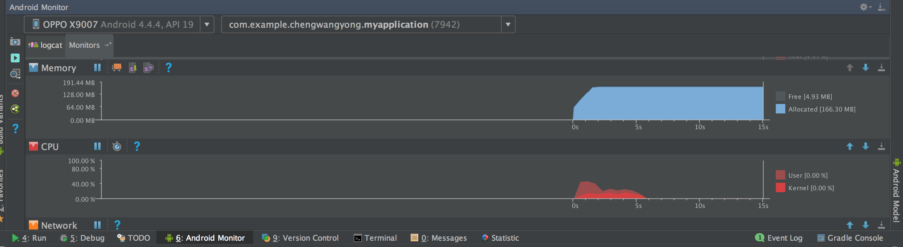
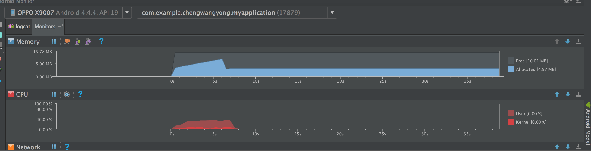

# ImageFrame
[点我,查看中文ReadMe](README_chinese.md)

>Efficient memory province to play the serial frame control, support from the file, resource read sequence frames, memory reuse, read multiple, just a picture of memory, streaming API, a line of code can achieve serial frame animation

## 一 Project description:


1. The program is designed because of their long live projects, some places use some PNG frames to synthesize some animation needs. Of course, webP and Apng may be good, but also some WebP low version compatibility in Android, Apng in the realization of both memory Android occupy a large, low decoding efficiency, until later see an article of the Tencent

> [通过三次优化，我将gif加载优化了16.9%](http://note.youdao.com/)

Since the Tencent article has always been described only without specific code, this project is the specific implementation of this article,

The basic principle is still a two thread collaboration, the child thread is responsible for decoding pictures, the main thread is responsible for receiving pictures after setting to the View, because of internal memory reuse, and only occupy a picture of memory

2.Performance tests, memory usage, CPU occupancy

(1)Read directly from the 200 diagram, direct OOM

(2)Read while write, memory on OPPO x9007 is as follows:


(3)After the adoption of this project, the memory footprint on x9007 is as follows:



Memory occupies only one image memory, and CPU occupies about 14%, which has met most of the project scenarios, and has no compatibility and decoding efficiency;


## 一.Configure and start using

project build.gradle add **jitpack**Warehouse
```
	allprojects {
		repositories {
			...
			maven { url 'https://jitpack.io' }
		}
	}
```

add the plugin to your buildscript:
```
	dependencies {
	        compile 'com.github.Mr-wangyong:ImageFrame:v1.3.0'
	}
```


## V1.3 Significant updates, streaming API, specify playback locations, pause, focus on sequence frame parsing, and more powerful custom features

​	 The project is refactoring, and part of the API is marked as obsolete. `@Deprecated` is not recommended, and the structure instead of `ImageFrameHandler` is responsible for handling sequence frame loading through callback `OnImageLoadListener`
   Return the `BitmapDrawable` to the external View settings picture, focus on sequence frame processing, easy for external free custom operation; at the same time, API reference `AlertDialog` flow type API, more concise and easy to use;
   Increased API:

> play

```
build.start();//开始播放序列帧
```

> pause

```
build.pause();//暂停播放
```

> Specifies starting from a frame:

```
build.setStartIndex(10)
```

> Specifies to end from a frame:

```
build.setEndIndex(10)
```


> Support read from the file /Resource directory. Streaming API, concise and easy to use

- Read from file:

  1.  **simple pattern**, you can create a custom View, encapsulate these functions,[ImageFrameCustomView](https://github.com/Mr-wangyong/ImageFrame/blob/master/app/src/main/java/com/example/chengwangyong/imageframe/ImageFrameCustomView.java), I'm here to give you the implementation (of course, suggestions according to the requirements of the project definition of a better and more practical), can directly call the `startImageFrame`method on frame animation sequence

     ```
     imageFrame.startImageFrame(new ImageFrameHandler.FileHandlerBuilder(file.listFiles())
     	.setFps(40)// Set FPS (how many frames per second to play, suggest no more than 30, default 30 is too large, device performance is not enough, disk may not read, lost frames)

       .setWidth(100)// Set the width of the picture. You must set it internally, otherwise it will not

       .setHeight(300)// Set image height must not be ibid

       .setStartIndex(10)// Sets the beginning of the sequence frame picture index, which can be specified starting from that picture

       .setEndIndex(30)// Set the end of the sequence frame picture index, which can be specified from the end of that picture

       .setLoop(true)// Set whether to loop playback

       .openLruCache(true)// Sets whether or not to open the LRU cache. If not, it is not recommended to open the loop. If the loop is recommended, it is open, but the performance of several tests is not very differen

       .build());// build

     ```

     ​


2.   **custom mode**, any View, more custom control loading process;
	 ```
      File file =  new File(testDir);
      //Create a FileHandlerBuilder that is similar to API and Android system AlertDialog
      ImageFrameHandler build = new ImageFrameHandler.FileHandlerBuilder(file.listFiles())
      //File[] must be passed in as a processing source
          .setFps(40)
          // // Set FPS (how many frames per second to play, suggest no more than 30, default 30 is too large, device performance is not enough, disk may not read, lost frames)
          .setWidth(100)
          // Set the width of the picture. You must set it internally, otherwise it will not
          .setHeight(300)// Set image height must not be ibid
          .setStartIndex(10)
          // Sets the beginning of the sequence frame picture index, which can be specified starting from that picture
          .setEndIndex(30)
          // Set the end of the sequence frame picture index, which can be specified from the end of that picture
          .setLoop(true)// Set whether to loop playback
          .openLruCache(true)// Sets whether or not to open the LRU cache. If not, it is not recommended to open the loop. If the loop is recommended, it is open, but the performance of several tests is not very differen
          .setOnImageLoaderListener(new ImageFrameHandler.OnImageLoadListener() {
            //Create a listener, listen, parse successfully, and complete parsing
            @Override
            public void onImageLoad(BitmapDrawable drawable) {
              //Set the picture for your View
             ViewCompat.setBackground(view,drawable);
            }
      
            @Override
            public void onPlayFinish() {
      
            }
          })
          .build();// Build a Handler to handle
      
      build.start();//Begin to play sequence frames
     ```

 Of course, you can also have `stop`, `pause`, and more freely control the loading process;

  ```
  build.start();//Begin to play sequence frames

  build.pause();//Pause play

  build.stop();//stop play
  ```

  ​

- Read from the Resource directory

  The principle is the same, but the build is`ResourceHandlerBuilder`

  ```
  final int[] resIds = new int[210];
      ImageFrameHandler build = new ImageFrameHandler.ResourceHandlerBuilder(getResources(),resIds)//You must pass in the Resource and resIds resources, the ID collection as the processing source
        .setFps(40)
                  // // Set FPS (how many frames per second to play, suggest no more than 30, default 30 is too large, device performance is not enough, disk may not read, lost frames)
                  .setWidth(100)
                  // Set the width of the picture. You must set it internally, otherwise it will not
                  .setHeight(300)// Set image height must not be ibid
                  .setStartIndex(10)
                  // Sets the beginning of the sequence frame picture index, which can be specified starting from that picture
                  .setEndIndex(30)
                  // Set the end of the sequence frame picture index, which can be specified from the end of that picture
                  .setLoop(true)// Set whether to loop playback
                  .openLruCache(true)// Sets whether or not to open the LRU cache. If not, it is not recommended to open the loop. If the loop is recommended, it is open, but the performance of several tests is not very differen
                  .setOnImageLoaderListener(new ImageFrameHandler.OnImageLoadListener() {
                    //Create a listener, listen, parse successfully, and complete parsing
                    @Override
                    public void onImageLoad(BitmapDrawable drawable) {
                      //Set the picture for your View
                     ViewCompat.setBackground(view,drawable);
                    }

                    @Override
                    public void onPlayFinish() {

                    }
                  })
                  .build();// Build a Handler to handle

    build.start();//Begin to play sequence frames
  ```

  ​

## V1.2 update

Take the picture loading section as a module ImageFrameProxy; API, like ImageFrameView, turns ImageFrameView into an example; you can add more processing after you get the bitmap;


## V1.1 update

1. Add loop playback function (remove Lru cache function)
```
imageFrame.setLoop(true);
```
2. Add stop playback function
```
imageFrame.stop();
```

---


## consult:
Android About Bitmap reuse:
> https://developer.android.com/training/displaying-bitmaps/manage-memory.html#recycle


